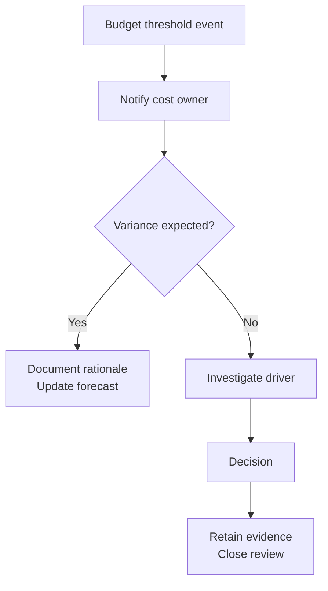

# FinOps Cost Governance Foundations

-yellow)

---

## Purpose
This repository demonstrates a **governance-first** approach to cloud cost control:

- budgeting & variance discipline  
- cost accountability (ownership + allocation logic)  
- executive-ready reporting  
- evidence retention suitable for review (leadership, finance, audit)

**This is not a cloud engineering repo.**  
It intentionally avoids deep configuration steps, IAM protocols, and on-call operational claims.

### Target roles
- Cloud Cost Analyst  
- IT Financial Analyst  
- FinOps Analyst / Cost Governance Analyst  
- TBM / Technology Cost Management Analyst  

---

## Start here (fast review path)
If you only have a few minutes:

1. **Primary proof pack:**  
   [Proof Pack 01 — Budget vs Actuals & Variance Governance](01-proof-packs/finops-01-budget-variance-governance/README.md)

2. **Executive summary (one page):**  
   [Proof Pack 01 — Executive Summary](01-proof-packs/finops-01-budget-variance-governance/executive-summary.md)

3. **Decision logic (how governance decisions are made):**  
   [Financial logic (variance, forecast, allocation)](01-proof-packs/finops-01-budget-variance-governance/financial-logic.md)

4. **Traceability register (evidence index):**  
   [Evidence index (Proof Pack 01)](01-proof-packs/finops-01-budget-variance-governance/evidence/evidence-index.md)

---

## Foundational context (repo standards)
These documents define how this repository should be reviewed and what it intentionally does not claim:

- [Operating principles (repo standards)](00-context/operating-principles.md)
- [How to review this repository](00-context/how-to-review.md)
- [Data sources (conceptual ownership & cadence)](00-context/data-sources.md)
- [Scope boundaries](00-context/scope-boundaries.md)
- [Assumptions](00-context/assumptions.md)
- [Maturity positioning](00-context/maturity-positioning.md)

---

## Problem statement
Cloud spend becomes difficult to manage when:
- ownership is unclear (allocation gaps)
- budgets are reviewed inconsistently
- variance explanations are ad hoc
- decisions lack a retained evidence trail

---

## Governance approach
Enterprise financial control discipline applied to cloud spend:

- establish baseline budgets and ownership  
- define variance thresholds and escalation criteria  
- require documented explanation and decision logging  
- retain evidence inputs/outputs for review  

> **Analyst note**  
> This repository uses sample/sanitized data to demonstrate methodology without implying access to any employer billing system or production tenant.

---

## Proof packs
### Proof Pack 01 — Budget vs Actuals & Variance Governance
- [Proof Pack 01 README](01-proof-packs/finops-01-budget-variance-governance/README.md)
- [Executive summary](01-proof-packs/finops-01-budget-variance-governance/executive-summary.md)
- [Financial logic](01-proof-packs/finops-01-budget-variance-governance/financial-logic.md)
- [Evidence index](01-proof-packs/finops-01-budget-variance-governance/evidence/evidence-index.md)

---

## Operating model
Defines how governance runs on a repeatable cadence.

- [Monthly FinOps close (operating rhythm)](02-operating-models/monthly-finops-close.md)

---

## Reporting templates
Standardized artifacts used across proof packs.

- [Exec brief one-pager](03-reporting-templates/exec-brief-onepager.md)
- [Monthly cost review agenda](03-reporting-templates/monthly-cost-review-agenda.md)
- [Variance commentary template](03-reporting-templates/variance-commentary-template.md)

---

## Scope boundaries
**Included**
- governance & financial analysis  
- reporting and documentation discipline  
- cost ownership and allocation logic  

**Excluded**
- deep Azure configuration  
- IAM implementation details  
- security tooling deep dives  
- on-call engineering responsibilities  

Details:
- [Scope boundaries](00-context/scope-boundaries.md)
- [Assumptions](00-context/assumptions.md)

---

## Visual: Budget variance governance flow

The flow below illustrates how budget variance events are reviewed, investigated, and closed within a controlled FinOps operating rhythm.

**Key notes (diagram legend)**  
- **Investigate driver** includes: service, team, category  
- **Decision** includes: approve increase, correct allocation, reduce usage  

---
## Background alignment

- MBA + BS Accounting
- 20+ years in high-accountability environments (U.S. Navy, federal, aerospace)
- Budget ownership, cost control, procurement governance, audit readiness
- Executive reporting and documentation discipline
