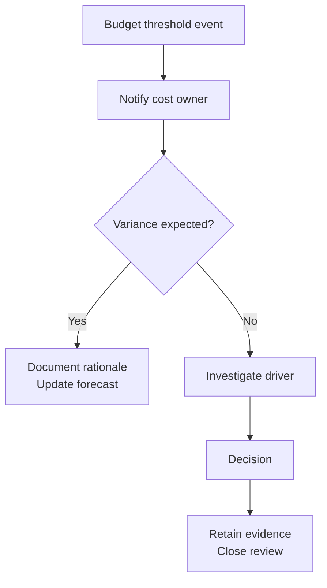

# FinOps Cost Governance Foundations

-yellow)

## Purpose
This repository demonstrates a **governance-first** approach to cloud cost control:
- budgeting & variance discipline
- cost accountability (ownership + allocation logic)
- executive-ready reporting
- evidence retention suitable for review (leadership, finance, audit)

**This is not a cloud engineering repo.** It intentionally avoids deep configuration steps, IAM protocols, and on-call operational claims.

**Target roles**
- Cloud Cost Analyst
- IT Financial Analyst
- FinOps Analyst / Cost Governance Analyst
- TBM / Technology Cost Management Analyst

---

## Contents
- [Problem statement](#problem-statement)
- [Governance approach](#governance-approach)
- [Financial logic](#financial-logic)
- [Evidence plan](#evidence-plan)
- [Proof packs](#proof-packs)
- [Operating model](#operating-model)
- [Templates](#templates)
- [Scope boundaries](#scope-boundaries)

---

## Problem statement
Cloud spend becomes difficult to manage when:
- ownership is unclear (allocation gaps)
- budgets are reviewed inconsistently
- variance explanations are ad hoc
- decisions lack a retained evidence trail

---

## Governance approach
I apply enterprise financial control discipline to cloud spend:
- establish a baseline budget
- define variance thresholds and escalation criteria
- require documented explanation and decision logging
- retain evidence inputs/outputs for review

> **Analyst Note**
> This repo uses sample/sanitized tables to demonstrate methodology without implying access to any employer billing system or production tenant.

---

## Financial logic
See:
- [Budget & variance logic (Proof Pack 01)](01-proof-packs/finops-01-budget-variance-governance/financial-logic.md)
- [Control framing](00-context/control-alignment.md)

---

## Evidence plan
Every proof pack includes:
- an [Evidence index](01-proof-packs/finops-01-budget-variance-governance/evidence/evidence-index.md)
- sample tables (sanitized)
- explicit assumptions
- clear scope boundaries

---

## Proof packs
Start here:
- **[Proof Pack 01 — Budget vs Actuals & Variance Governance](01-proof-packs/finops-01-budget-variance-governance/README.md)**
  - [Executive summary](01-proof-packs/finops-01-budget-variance-governance/executive-summary.md)
  - [Evidence index](01-proof-packs/finops-01-budget-variance-governance/evidence/evidence-index.md)
  - [Evidence tables](01-proof-packs/finops-01-budget-variance-governance/evidence/tables/)

Portfolio map:
- **[PORTFOLIO.md](PORTFOLIO.md)**

---

## Operating model
- [Monthly FinOps Close (Operating Rhythm)](02-operating-models/monthly-finops-close.md)

---

## Templates
- [Exec brief one-pager](03-reporting-templates/exec-brief-onepager.md)
- [Monthly cost review agenda](03-reporting-templates/monthly-cost-review-agenda.md)
- [Variance commentary template](03-reporting-templates/variance-commentary-template.md)

---

## Scope boundaries
Included: governance, financial analysis, reporting, controls mindset, documentation discipline  
Excluded: deep Azure configuration, IAM protocols, security tooling deep dives, on-call engineering

Details:
- [Scope boundaries](00-context/scope-boundaries.md)
- [Assumptions](00-context/assumptions.md)

---

## Visual: Budget variance governance flow

The flow below illustrates how budget variance events are reviewed, investigated, and closed within a controlled FinOps operating rhythm.

**Key notes (diagram legend)**  
- **Investigate driver** includes: service, team, category  
- **Decision** includes: approve increase, correct allocation, reduce usage  

---
## Background alignment

- MBA + BS Accounting
- 20+ years in high-accountability environments (U.S. Navy, federal, aerospace)
- Budget ownership, cost control, procurement governance, audit readiness
- Executive reporting and documentation discipline
